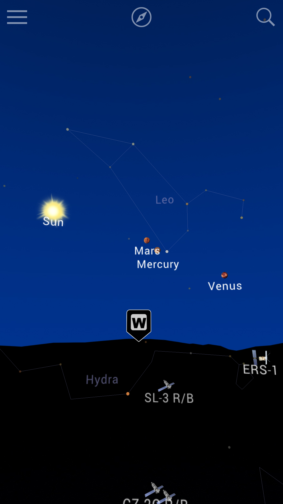
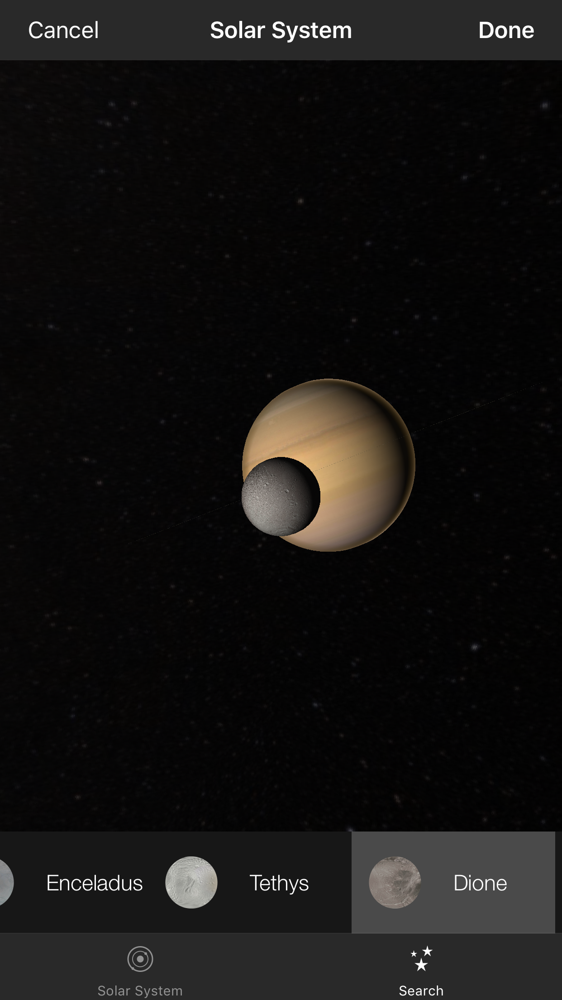
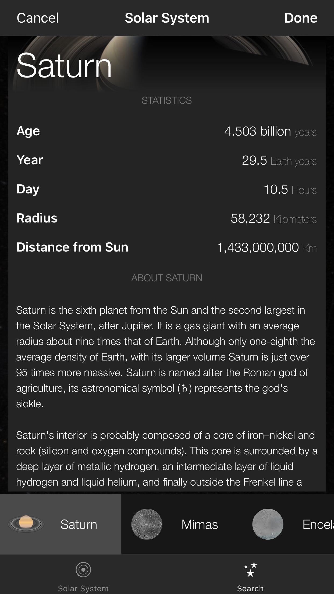
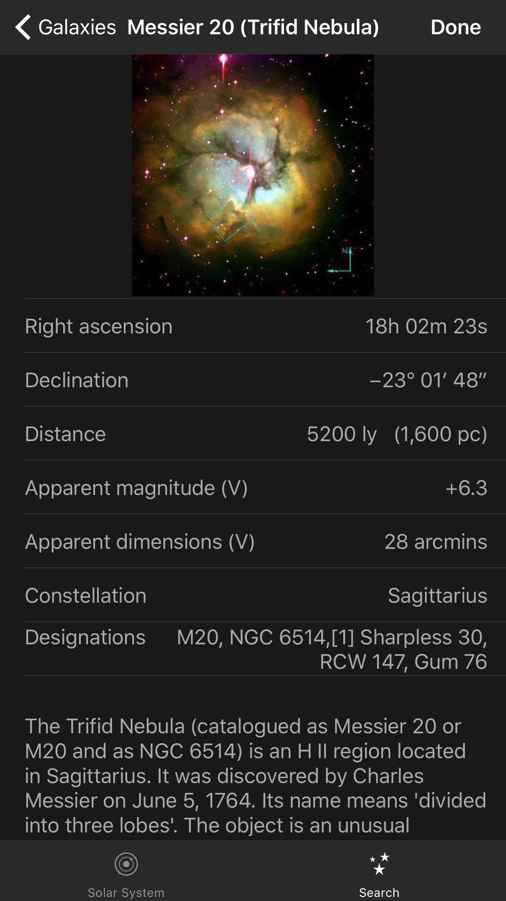
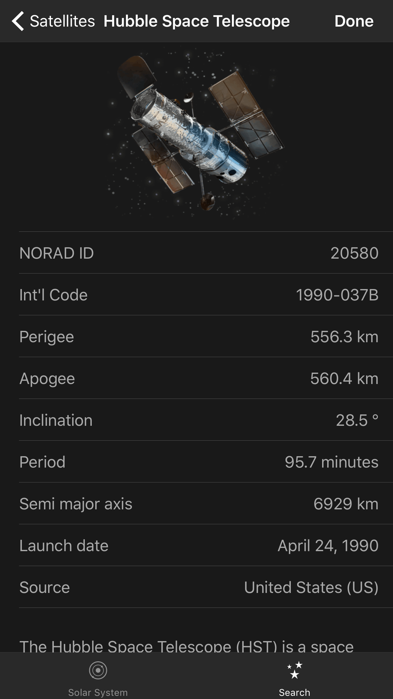

[](https://www.gnu.org/licenses/agpl-3.0)
[](https://dashboard.buddybuild.com/apps/597c9d47a2538b0001c92e70/build/latest?branch=master)


- Blocks content from annoying ad networks thereby loading pages super fast

- Useful for data-capped, international roaming data connections

- Blocking rules are at [RediffBlock/blockerList.json](RediffBlock/blockerList.json)

- View JSON in app

- Universal app contains link to Settings, JSON and instructions for turning on Content Blockers

## Screenshots








## How to Install - iOS

You need Xcode 9 or later. And an iOS device running at least iOS 8.

Step 1

Open a new terminal window in OS X. Refer to [this guide](http://blog.teamtreehouse.com/introduction-to-the-mac-os-x-command-line) on using the OS X Terminal.

```bash
git clone https://github.com/azurcoding/Starglobe.git
```

Step 2

```bash
  cd Starglobe/apps/star3map/iphone
```

Step 3
For this step you will need to have Cocoapods installed. How to install Cocoapods: [https://cocoapods.org](https://cocoapods.org)
Delete `Starglobe.xcworkspace` and then run this command:
```bash
  pod install
```

Step 4

Open `Starglobe.xcworkspac` in Xcode.


Step 5

Build and run the application.

- When running this application on a device you will need to add a signing profile in the project's Build Settings.


## Tested

- iPad mini 2 running iOS 10
- iPhone 6 running iOS 10
- Desktop version tested on Safari 9 for Yosemite & El Capitan

## Device Compatibility

- iPhone: iPhone 5 and above
- iPad: iPad (4th generation) or iPad mini (2nd generation) and above
- iPod touch: iPod touch (6th generation)

## License

