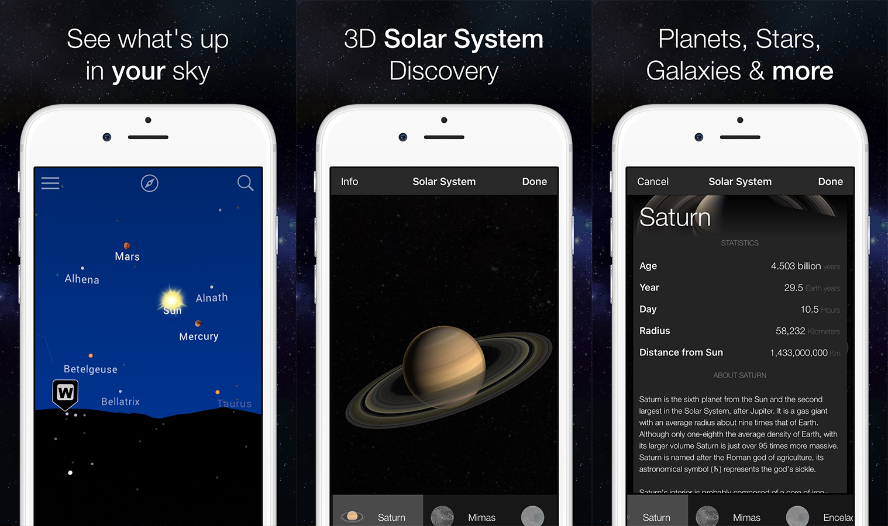

[](https://itunes.apple.com/app//id703554364)

[](https://www.gnu.org/licenses/agpl-3.0)
[](https://dashboard.buddybuild.com/apps/597c9d47a2538b0001c92e70/build/latest?branch=master)


Starglobe is a beautiful and intuitive stargazing app that uses your camera to precisely spot and identify celestial objects in sky, day or night. Find your favorite constellations as they fade in and out while you scan across the sky, locate the Moon, discover distant galaxies, and witness satellite fly-bys.

- Simple: Point your device at the sky to identify galaxies, stars, constellations and satellites (including the ISS and Hubble) passing overhead at your location.
- Augmented Reality (AR): Use your camera to spot objects in the sky, day or night.
- Huge stellar catalog: 111,000 stars, galaxies constellations and satellites!
- Get the facts on what you are looking at, including distance and brightness.
- Red night mode: Preserve your dark-adapted eyesight.
- Social: Capture and share beautiful images with friends and family on social networks. 
- Mobile: WiFi is NOT required (does not require a data signal or GPS to function). Take it camping, boating, or even flying!

## Screenshots



## How to Install - iOS

You need Xcode 9 or later. And an iOS device running at least iOS 8.

Step 1

Open a new terminal window in OS X. Refer to [this guide](http://blog.teamtreehouse.com/introduction-to-the-mac-os-x-command-line) on using the OS X Terminal.

```bash
git clone https://github.com/azurcoding/Starglobe.git
```

Step 2

```bash
cd Starglobe/apps/star3map/iphone
```

Step 3

For this step you will need to have Cocoapods installed. (How to install Cocoapods: [https://cocoapods.org](https://cocoapods.org))

Delete `Starglobe.xcworkspace` and then run this command:
```bash
pod install
```

Step 4

Open `Starglobe.xcworkspace` in Xcode.


Step 5

Build and run the application.

- When running this application on a device you will need to add a signing profile in the project's Build Settings.

## Device Compatibility

- iPhone: iPhone 5s and above
- iPad: iPad (5th generation) or iPad mini (2nd generation) and above
- iPod touch: iPod touch (6th generation)


## Pull Requests

If you want to help improve Starglobe, please do so in the form of a Pull Request. When creating a PR, you will be asked to agree to the Contributor License Agreement (CLA).

## License
Starglobe is licensed under the [GNU Affero General Public License v3.0](/LICENSE)

## Author

AZSignupController is brought to you by Azurcoding


[](https://azurcoding.com)
